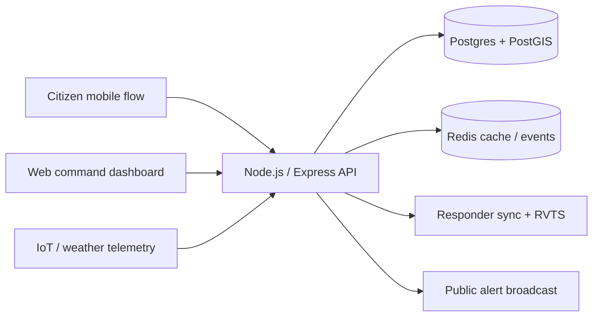

# SafeGuard UAE

AI-assisted disaster and emergency management platform for smart-city coordination in the UAE.

## Vision

SafeGuard UAE combines live web command operations, mobile citizen and responder flows, and IoT telemetry ingestion so agencies can predict hazards earlier, route help faster, and keep lanes clear during emergencies.

## Architecture



## Repository Structure

- `README.md`: product vision, architecture, setup, API summary, and roadmap.
- `backend/`: Express API with Socket.IO, authentication, incident handling, telemetry ingestion, SOS flow, and demo state.
- `db/`: PostGIS schema files and seed data for the smart-city data model.
- `frontend/`: Vite + React command dashboard with map visualizations, analytics, RVTS, and coordination actions.
- `mobile-preview/`: Standalone Vite + React simulator for citizen and responder app flows.

## Main Features

- AI disaster prediction dashboard and dynamic risk scoring matrix.
- Assisted-response synchronization for multi-agency field coordination.
- Geofenced smart public alerts with evacuation route recommendations.
- Responder Visibility Traffic System (RVTS) for lane-clearing warnings.
- IoT microclimate telemetry ingestion for temperature, flood level, and air quality.
- Biometric-secured mobile UX with instant SOS reporting and safe-route guidance.

## Demo Credentials

The project ships with local demo accounts seeded in the backend and database scripts so you can explore the command dashboard and mobile preview immediately. Check the source seed data if you need the current demo identities for a local run.

Mobile biometric unlock is a demo flow. Face ID and fingerprint buttons unlock the simulator without backend verification.

## Setup

### Docker-first workflow

Start the full stack with Docker Compose from the repository root:

```bash
docker compose up --build
```

This brings up:

- `db` on `5432`
- `redis` on `6379`
- `backend` on `8080`
- `frontend` on `5173`
- `mobile-preview` on `5174`

### Local development

If you prefer running services individually, install dependencies in each app folder and start the matching dev script from its `package.json`.

## Environment

The backend reads these environment variables:

- `PORT`: API port, defaults to `8080`.
- `JWT_SECRET`: token signing secret, defaults to a demo value.
- `ALLOWED_ORIGINS`: comma-separated list of frontend origins.

The web apps default to `http://localhost:8080/api` for API requests, and the compose file injects the same API URL for Docker runs.

## API Summary

### Authentication

- `POST /api/auth/login`
- `GET /api/auth/me`

### Command Dashboard

- `GET /api/health`
- `GET /api/dashboard`
- `GET /api/predictions`

### Incidents and Dispatch

- `GET /api/incidents`
- `POST /api/incidents`
- `GET /api/responders`
- `PATCH /api/responders/location`
- `POST /api/responders/dispatch`

### Telemetry and Alerts

- `GET /api/telemetry/live`
- `POST /api/telemetry/ingest`
- `GET /api/alerts/active`
- `POST /api/alerts/send`

### Public Safety and RVTS

- `GET /api/hospitals`
- `GET /api/risk-zones`
- `GET /api/rvts/lanes`
- `POST /api/sos`

## Data Model

The database files in `db/` include PostGIS-enabled tables for agencies, users, responders, incidents, telemetry, alerts, hospitals, risk zones, and RVTS warnings. The Docker init script seeds a working demo dataset so the schema is ready for local experimentation.

## Deployment Roadmap

1. Keep the current demo API and UI flows stable for presentation and testing.
2. Swap the in-memory backend store for live PostgreSQL persistence.
3. Wire Docker services for the web and mobile apps if containerized demos are needed.
4. Add real MQTT/IoT ingestion and geospatial routing once field devices are available.

## Notes

- The repo now uses `frontend/` for the web dashboard and `mobile-preview/` for the phone simulator.
- `web/` was the old scaffold and has been removed from the active build.
- Docker is the primary way to run the project, and the compose file provisions Postgres/PostGIS, Redis, backend, and both UIs together.
